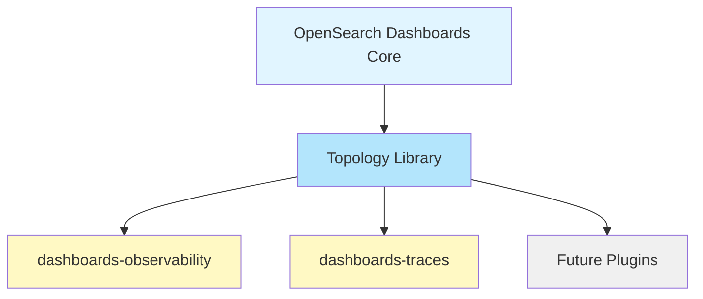
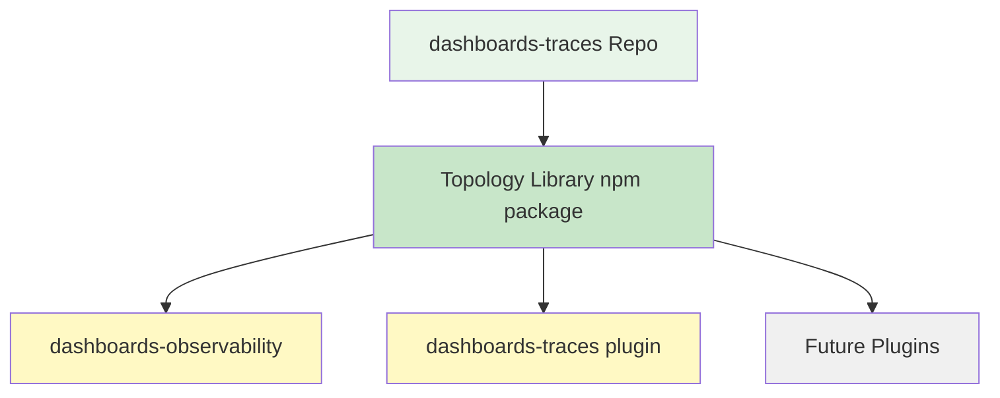
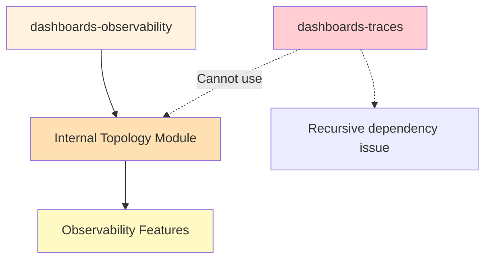

# Architectural Decision: OpenSearch APM Topology Library Placement

## Overview

### Context
The OpenSearch APM Topology library (formerly APMCelestial) is being open-sourced from the AWSAPMDashboardsPlugin. The library has been successfully:
- Stripped of AWS-specific configurations, dependencies, and build scripts
- Migrated to a standalone repository at `apm-topology`
- Enhanced with comprehensive documentation and examples
- Prepared with OpenSearch license headers

### Current State
- **Library Location**: Standalone repository at `/Users/sgguruda/work/opensource/repos/apm-topology`
- **Package Name**: `@ps48/apm-topology`
- **Status**: Ready for integration into OpenSearch ecosystem
- **Next Step**: UI and server pieces will move to `dashboards-observability` plugin
- **Challenge**: Determine optimal location for the topology visualization library

### Decision Required
Choose the best architectural approach for hosting the OpenSearch APM Topology library to enable use by:
1. `dashboards-observability` plugin (primary consumer)
2. `dashboards-traces` plugin (secondary consumer - Discover traces functionality)
3. Potential future OpenSearch plugins requiring topology visualization

### Architecture Discovery
Research into the OpenSearch Dashboards packages structure revealed critical constraints:

- ✅ `dashboards-observability`: INTERNAL to OSD at `opensearch-dashboards/plugins/dashboards-observability`
- ❌ `dashboards-traces`: EXTERNAL repository at https://github.com/opensearch-project/dashboards-traces

**OSD Packages Constraint**: Packages in `/packages/` are:
- Private (not published to npm registry)
- Only consumable within OSD monorepo via yarn workspaces
- Cannot be used by external repositories

This finding eliminates certain placement options and strongly influences the recommendation.

---

## Solution Options

### Option 1: Integrate into OpenSearch Dashboards Core

**Description**: Move the library into `opensearch-dashboards/src/core/public/topology/` or a similar core location, making it available to all plugins.

#### Architecture Diagram


#### Pros
✅ **Single Source of Truth**: All plugins use the exact same version
✅ **No External Dependencies**: No npm registry dependency
✅ **Direct Access**: Plugins can import directly from core
✅ **Centralized Maintenance**: Core team ownership
✅ **No Version Conflicts**: Guaranteed compatibility across plugins
✅ **Type Safety**: Full TypeScript integration with core
✅ **Zero Installation**: Available immediately to all plugins

#### Cons
❌ **Increases Bundle Size**: Core bundle grows by ~700KB (ESM) / ~565KB (CommonJS)
❌ **Affects All Plugins**: Increases download/load time even for plugins not using it
❌ **Slower Core Releases**: Library updates tied to OSD release cycle
❌ **Breaking Changes Impact**: Library changes affect core stability
❌ **Limited Flexibility**: Plugins can't choose different library versions
❌ **Core Team Burden**: Core team must maintain visualization library
❌ **Harder to Iterate**: Experimental features require core approval
❌ **React Version Conflict**: Library uses React 18.x, OSD core uses React 16.x

#### Implementation Complexity
**Effort**: Medium

**Steps**:
1. Downgrade library from React 18.x to 16.x for compatibility
2. Add library to `opensearch-dashboards/src/core/public/topology/`
3. Export from core public API
4. Update core build configuration
5. Add to core package.json dependencies
6. Update all consuming plugins

#### Bundle Impact Analysis
```
Current Core Bundle: ~5-8 MB (varies by features enabled)
Topology Library: ~700 KB (uncompressed ESM)
Increase: ~8-12% of core bundle size

Gzipped:
Current: ~1.5-2.5 MB
With Topology: ~1.7-2.7 MB
Increase: ~8%
```

---

### Option 2: Use opensearch-project/dashboards-traces Repository

**Description**: Place the library in the existing `dashboards-traces` repository, originally created to separate Discover traces functionality.

#### Architecture Diagram


#### Pros
✅ **Repository Exists**: No new repo creation needed
✅ **Observability Focus**: Natural fit within observability domain
✅ **Independent Releases**: Separate from OSD release cycle
✅ **Existing Infrastructure**: CI/CD likely already set up
✅ **Version Control**: Plugins choose which version to use
✅ **Faster Iteration**: Changes don't require core approval
✅ **React 18.x Maintained**: No React version downgrade required

#### Cons
❌ **Separate Maintenance**: Requires dedicated maintenance
❌ **Dependency Management**: Plugins must track versions
❌ **Naming Confusion**: "traces" repo contains topology library
❌ **Potential Conflicts**: May complicate traces-specific work
❌ **Build Overhead**: Must publish to npm registry
❌ **Version Mismatches**: Different plugins may use different versions
❌ **Discovery Issues**: Non-obvious location for topology library

#### Implementation Complexity
**Effort**: Medium

**Steps**:
1. Move library to `dashboards-traces/packages/apm-topology/`
2. Set up monorepo structure (if not already)
3. Configure npm publishing
4. Update consuming plugins to install from npm
5. Establish maintenance ownership

#### Organizational Clarity
```
dashboards-traces/
├── packages/
│   ├── traces-plugin/          # Original purpose
│   └── apm-topology/            # Topology library (confusing?)
```

---

### Option 3: Create New Standalone Repository with npm Package

**Description**: Maintain the current standalone `apm-topology` repository and publish as an npm package that plugins install as a dependency.

#### Architecture Diagram
```mermaid
graph TD
    A[apm-topology Repository] --> B[@ps48/apm-topology npm package]
    B --> C[dashboards-observability]
    B --> D[dashboards-traces]
    B --> E[Future Plugins]
    B --> F[External Projects]

    style A fill:#f3e5f5
    style B fill:#e1bee7
    style C fill:#fff9c4
    style D fill:#fff9c4
    style E fill:#f0f0f0
    style F fill:#ffccbc
```

#### Pros
✅ **Clear Separation**: Dedicated repository for visualization library
✅ **Independent Lifecycle**: Own release schedule
✅ **Maximum Flexibility**: Plugins control versions independently
✅ **External Reusability**: Community can use outside OpenSearch
✅ **Clean Semantics**: Name clearly indicates purpose
✅ **Focused Maintenance**: Library-specific team/ownership
✅ **Easier Contributions**: Clear boundaries for contributors
✅ **No Core Impact**: Zero effect on core bundle or stability
✅ **React 18.x Maintained**: No React version downgrade required
✅ **Works with External Repos**: dashboards-traces can consume it

#### Cons
❌ **Repository Setup Time**: Must create new OpenSearch project repo
❌ **Separate Maintenance**: Requires dedicated maintenance
❌ **CI/CD Configuration**: Must set up from scratch
❌ **npm Publishing**: Must configure npm registry publishing
❌ **Version Coordination**: Plugins must stay updated
❌ **Discovery Overhead**: Developers must find external package
❌ **Dependency Updates**: Breaking changes affect all consumers

#### Implementation Complexity
**Effort**: High (initial setup), Low (ongoing)

**Steps**:
1. Request new repository in opensearch-project organization
2. Transfer current work to new repo
3. Set up GitHub Actions for CI/CD
4. Configure npm publishing automation
5. Establish governance and maintainership
6. Create contribution guidelines
7. Update consuming plugins

#### Repository Structure
```
opensearch-project/apm-topology/
├── lib/                    # Library source
├── example/                # Demo application
├── .github/workflows/      # CI/CD
├── TROUBLESHOOTING.md      # Documentation
└── README.md
```

---

### Option 4: Place in dashboards-observability Plugin

**Description**: Include the topology library directly within the `dashboards-observability` plugin as an internal module.

#### Architecture Diagram


#### Pros
✅ **Zero External Dependencies**: No npm package needed
✅ **Tight Integration**: Optimal for observability features
✅ **Single Repository**: All related code together
✅ **Fast Iteration**: No external release coordination
✅ **Simple Setup**: No new infrastructure needed
✅ **Immediate Availability**: Ready to use in observability

#### Cons
❌ **Discover Traces Cannot Use It**: Recursive dependency prevents use by `dashboards-traces`
❌ **Not Reusable**: Other plugins cannot consume
❌ **Tight Coupling**: Library tied to observability lifecycle
❌ **Code Duplication Risk**: Others may reimplement topology
❌ **Limited Reach**: Can't be used by external projects
❌ **Maintenance Burden**: Observability team owns visualization code
❌ **Harder to Extract**: Future extraction would be difficult

#### Implementation Complexity
**Effort**: Low

**Steps**:
1. Move library to `dashboards-observability/public/components/topology/`
2. Import and use within observability features
3. Accept that traces cannot use it

#### Dependency Issue Explained
```
Scenario:
- dashboards-observability depends on dashboards-traces (for trace features)
- dashboards-traces wants to use topology library
- Topology is in dashboards-observability

Result: Circular dependency
dashboards-observability → dashboards-traces → dashboards-observability ❌
```

---

### Option 5: OSD Packages Directory

**Description**: Place library in OpenSearch Dashboards `/packages/` directory as `@osd/apm-topology`, following the established internal package pattern.

#### Architecture Diagram
```mermaid
graph TD
    A[OpenSearch Dashboards Monorepo] --> B[@osd/apm-topology Package]
    B --> C[dashboards-observability]
    B -.->|Cannot consume| D[dashboards-traces External]
    B --> E[Internal Plugins Only]

    style A fill:#e8eaf6
    style B fill:#c5cae9
    style C fill:#fff9c4
    style D fill:#ffcdd2
    style E fill:#f0f0f0

    Note1[External repos cannot use OSD packages]
    D -.-> Note1
```

#### Pros
✅ **Follows Established Pattern**: Matches existing OSD package structure
✅ **Yarn Workspace Linking**: Automatic linking for internal plugins
✅ **No External npm Registry**: No publishing overhead
✅ **Direct Access for Internal Plugins**: Simple imports for OSD plugins
✅ **Precedent Exists**: osd-ui-shared-deps bundles React + charts
✅ **Consistent Build System**: Uses @osd/dev-utils like other packages
✅ **Version Consistency**: Guaranteed same version across OSD

#### Cons
❌ **CRITICAL: Cannot Be Used Externally**: dashboards-traces cannot consume it
❌ **Private Packages Only**: Not published to npm registry
❌ **Yarn Workspace Required**: Only works within OSD monorepo
❌ **React Version Conflict**: OSD uses React 16.x, library uses React 18.x
❌ **Tied to OSD Release Cycle**: Library updates require OSD release
❌ **No External Projects**: Community cannot use library
❌ **Less Flexible**: Plugins cannot choose library versions independently

#### Implementation Complexity
**Effort**: Medium

**Steps**:
1. Downgrade library from React 18.x to 16.x for compatibility
2. Move library to `opensearch-dashboards/packages/osd-apm-topology/`
3. Configure as private package with @osd namespace
4. Set up webpack build using @osd/dev-utils
5. Add to root package.json workspaces
6. Update dashboards-observability to consume (dashboards-traces cannot)

#### Package Structure
```
opensearch-dashboards/packages/osd-apm-topology/
├── src/
├── package.json ("private": true, "name": "@osd/apm-topology")
├── scripts/build.js
└── README.md
```

#### Research Findings: Why This Option Is Not Viable

Investigation of `/Users/sgguruda/work/opensource/repos/opensearch-dashboards/packages/` revealed:

1. **Private Packages**: All OSD packages are marked `"private": true` and never published to npm
2. **Workspace-Only**: Packages use yarn workspaces for linking, requiring specific monorepo setup
3. **Internal Only**: External repositories cannot consume OSD packages without being in the monorepo
4. **React 16.x**: OSD uses React 16.x while the library is built with React 18.x
5. **Build System**: Uses custom @osd/dev-utils and webpack configurations

**Critical Constraint**: Since `dashboards-traces` is an external repository (https://github.com/opensearch-project/dashboards-traces), it cannot consume packages from OSD's `/packages/` directory.

**Conclusion**: This option is **NOT VIABLE** for the current architecture where dashboards-traces is external.

---

## Comparison Matrix

| Criteria | Option 1: Core | Option 2: Traces Repo | Option 3: Standalone | Option 4: Observability | Option 5: OSD Packages |
|----------|---------------|---------------------|-------------------|----------------------|----------------------|
| **Bundle Impact** | ❌ High | ✅ None | ✅ None | ✅ None | ✅ None |
| **Reusability** | ✅ High | ✅ High | ✅ Highest | ❌ Low | ❌ Low |
| **Setup Effort** | 🟡 Medium | 🟡 Medium | ❌ High | ✅ Low | 🟡 Medium |
| **Maintenance Burden** | ❌ High | 🟡 Medium | 🟡 Medium | 🟡 Medium | 🟡 Medium |
| **Version Flexibility** | ❌ None | ✅ High | ✅ Highest | ❌ None | ❌ None |
| **Traces Access** | ✅ Yes | ✅ Yes | ✅ Yes | ❌ No | ❌ No (External) |
| **Release Independence** | ❌ No | ✅ Yes | ✅ Yes | ❌ No | ❌ No |
| **Clear Semantics** | 🟡 Okay | ❌ Confusing | ✅ Clear | 🟡 Okay | ✅ Clear |
| **External Use** | ❌ No | ✅ Yes | ✅ Yes | ❌ No | ❌ No |
| **React 18.x Support** | ❌ Requires Downgrade | ✅ Yes | ✅ Yes | ✅ Yes | ❌ Requires Downgrade |
| **Implementation Complexity** | 🟡 Medium | 🟡 Medium | ❌ High | ✅ Low | ❌ Not Viable |

Legend: ✅ Best | 🟡 Acceptable | ❌ Poor

---

## Recommended Solution

### **Option 3: Standalone Repository with npm Package**

#### Rationale

Based on comprehensive research and analysis, Option 3 is the clear recommendation:

1. **Technical Constraint**: dashboards-traces is external and cannot consume OSD private packages (eliminates Option 5)
2. **Circular Dependency**: Cannot place in dashboards-observability due to circular dependency with traces (eliminates Option 4)
3. **Bundle Size**: Avoids increasing core bundle by 8-12% (makes Option 1 less attractive)
4. **Semantic Clarity**: Dedicated topology repo is clearer than mixing with traces repo (Option 2)
5. **React Version**: Library can maintain React 18.x instead of downgrading to 16.x (Options 1 and 5 require downgrade)
6. **Maximum Reusability**: Enables use by:
   - ✅ dashboards-observability (internal plugin)
   - ✅ dashboards-traces (external repo)
   - ✅ Future plugins (internal or external)
   - ✅ External community projects
7. **Industry Standard**: Matches proven patterns from Elastic EUI, Grafana UI, Superset UI
8. **Already 90% Complete**: Library is already in standalone repo with documentation, examples, and build system
9. **Long-term Maintainability**: Clear ownership, contribution boundaries, and governance

#### Risk Mitigation

**Initial Setup Overhead**:
- Mitigated by: Library already exists in standalone repo, just needs official OpenSearch project repo
- Current state: Build system, tests, examples, documentation all complete

**Version Management**:
- Use strict semantic versioning (MAJOR.MINOR.PATCH)
- Establish deprecation policy (N-1 versions supported for 6 months)
- Automated dependency updates (Dependabot, Renovate)
- Clear communication in release notes

**Maintenance Burden**:
- Designate 1-2 maintainers from observability team
- Establish governance model (similar to other OpenSearch components)
- Enable community contributions
- Automated CI/CD reduces manual work

**Dependency Coordination**:
- Provide migration guides for breaking changes
- Announce deprecations one version ahead
- Maintain compatibility for at least 6 months

#### Implementation Roadmap

**Phase 1: Repository Setup**
1. Request new repository `opensearch-project/apm-topology` from OpenSearch maintainers
2. Transfer code from current location to new official repo
3. Set up GitHub Actions CI/CD (build, test, lint)
4. Configure automated npm publishing workflow
5. Add CODEOWNERS and governance documentation
6. Set up branch protection rules

**Phase 2: Initial Release**
1. Publish first official version to npm as `@ps48/apm-topology@1.0.0`
2. Create detailed release notes
3. Update documentation with installation instructions
4. Announce release in OpenSearch community channels

**Phase 3: Plugin Integration**
1. Update `dashboards-observability` to install and consume npm package
2. Update `dashboards-traces` to install and consume npm package
3. Remove any duplicate topology code from consuming plugins
4. Document integration patterns in OpenSearch docs
5. Create example integration code snippets

**Phase 4: Stabilization**
1. Monitor for issues in consuming plugins
2. Address any integration problems or bugs
3. Establish regular maintenance cadence
4. Create contribution guidelines for community
5. Set up issue triage process

#### Success Metrics

- ✅ Library successfully used by 2+ plugins (observability, traces)
- ✅ Zero increase in OSD core bundle size
- ✅ Fast turnaround for library updates (< 1 week for patches)
- ✅ Clear, comprehensive documentation for consumers
- ✅ Active community engagement (issues, PRs, discussions)
- ✅ Semantic versioning strictly followed
- ✅ CI/CD pipeline with 100% pass rate

---

## Alternative Recommendations by Priority

### If Standalone Repository is Not Feasible

**Second Choice: Option 2 (dashboards-traces repository)**
- **When to Choose**: If creating new repo is blocked or timeline is extremely critical (< 2 weeks)
- **Acceptable Trade-off**: Accept naming confusion for faster delivery
- **Considerations**: Existing infrastructure reduces setup time, but semantics are less clear

**Third Choice: Option 1 (Core)**
- **When to Choose**: If bundle size increase is acceptable and React downgrade is feasible
- **Acceptable Trade-off**: Accept core bundle increase and React 16.x downgrade for guaranteed availability
- **Considerations**: Simplest consumption model, but affects all OSD users

**Not Recommended: Option 4 (dashboards-observability)**
- **Reason**: Blocks `dashboards-traces` due to circular dependency
- **Only Consider If**: dashboards-traces confirms it will never need topology library (contradicts current requirements)

**Not Viable: Option 5 (OSD Packages)**
- **Reason**: Cannot be consumed by external repositories like dashboards-traces
- **Only Viable If**: dashboards-traces moves into OSD monorepo (major architectural change)

---

## Appendices

### A. Bundle Size Analysis

**Topology Library Size**:
```
Uncompressed:
- ESM: 697.81 KB
- CommonJS: 565.50 KB

Gzipped:
- ESM: 197.72 KB
- CommonJS: 179.46 KB

Brotli (typical production):
- ESM: ~150 KB (estimated)
- CommonJS: ~135 KB (estimated)
```

**Impact on Core** (if Option 1):
```
Current Core Bundle: ~5-8 MB (varies by features enabled)
With Topology: 5.7-8.7 MB uncompressed
Increase: ~8-12% of core bundle size

Gzipped:
Current: ~1.5-2.5 MB
With Topology: ~1.7-2.7 MB
Increase: ~8%
```

### B. Version Management Strategy

For **Option 3 (Recommended)**:

**Semantic Versioning**:
- **MAJOR** (X.0.0): Breaking changes to public API, requires consumer updates
- **MINOR** (0.X.0): New features, backward compatible, safe to upgrade
- **PATCH** (0.0.X): Bug fixes, backward compatible, should upgrade immediately

**Support Policy**:
- Latest major version: Full support (features, bugs, security)
- Previous major version: Security fixes only (6 months after new major)
- Older versions: Community support only

**Release Cadence**:
- Bug fixes: As needed (typically within 1 week of report)
- Minor features: Monthly release window (first week of month)
- Major versions: Quarterly planning, annual releases

**Breaking Change Process**:
1. Announce deprecation in version N with console warnings
2. Provide migration guide and examples
3. Maintain deprecated API through version N lifecycle
4. Remove in version N+1 (next major)
5. Support version N for 6 months after N+1 release

**Example Timeline**:
```
v1.0.0 (Jan): Initial release
v1.1.0 (Feb): Add new node types, deprecate old prop
v1.2.0 (Mar): Add edge styling options
v2.0.0 (Apr): Remove deprecated prop (breaking)
v2.0.0 → v1.x security fixes continue until Oct
```

### C. Maintenance Ownership Models

**Option 1 (Core)**: OpenSearch Dashboards Core Team
- **Pros**: Centralized governance, guaranteed maintenance
- **Cons**: Core team already at capacity, slower iteration

**Option 2 (Traces Repo)**: Observability Team + Traces Team
- **Pros**: Distributed load between teams
- **Cons**: Coordination overhead, unclear ownership

**Option 3 (Standalone - Recommended)**: Dedicated Library Team
- **Proposed**: 1-2 maintainers from observability team + community
- **Pros**: Focused expertise, clear ownership
- **Cons**: Requires dedicated time allocation

**Option 4 (Observability)**: Observability Team
- **Pros**: Tight feedback loop with primary consumer
- **Cons**: Scope creep, blocks external use

**Option 5 (OSD Packages)**: OpenSearch Dashboards Team
- **Pros**: Follows existing patterns
- **Cons**: Not viable due to external consumer constraint

**Recommended Model for Option 3**:
- **Primary Maintainers**: 2 engineers from observability team (20% time allocation)
- **Secondary Reviewers**: 1-2 community contributors
- **Governance**: Follow OpenSearch project governance model
- **Triage**: Weekly issue review, monthly planning
- **Release**: Automated via CI/CD, maintainer approval required

### D. Dependency Tree Examples

**Option 1 (Core)**:
```
opensearch-dashboards (core)
├── @xyflow/react@11.x
├── @dagrejs/dagre@1.x
└── ... (all topology deps in core)

dashboards-observability
└── (imports from core, no external deps)

dashboards-traces
└── (imports from core, no external deps)
```

**Option 3 (Standalone - Recommended)**:
```
opensearch-dashboards (core)
└── (no topology dependencies)

dashboards-observability
└── @ps48/apm-topology@1.x
    ├── @xyflow/react@11.x
    ├── @dagrejs/dagre@1.x
    ├── react@18.x (peer dependency)
    └── react-dom@18.x (peer dependency)

dashboards-traces
└── @ps48/apm-topology@1.x (same version recommended)
    ├── @xyflow/react@11.x
    ├── @dagrejs/dagre@1.x
    ├── react@18.x (peer dependency)
    └── react-dom@18.x (peer dependency)
```

**Option 5 (OSD Packages - Not Viable)**:
```
opensearch-dashboards/packages/
└── osd-apm-topology/
    └── (private, cannot be consumed externally)

dashboards-observability (internal)
└── @osd/apm-topology@1.0.0 (yarn workspace link)

dashboards-traces (external)
└── ❌ Cannot consume @osd/apm-topology
```

### E. Migration Paths

**From Current State to Each Option**:

**To Option 3 (Recommended - Standalone)**:
```
Current: apm-topology (local standalone)
↓
1. Request new opensearch-project/apm-topology repo
2. Transfer code to official repo
3. Set up CI/CD (GitHub Actions)
4. Configure npm publishing
5. Publish v1.0.0 to npm
6. Update dashboards-observability package.json
7. Update dashboards-traces package.json

Effort: 2-3 weeks
Risk: Low (library already functional)
```

**To Option 1 (Core)**:
```
Current: apm-topology (React 18.x)
↓
1. Downgrade React 18.x → 16.x
2. Test thoroughly with React 16.x
3. Copy to opensearch-dashboards/src/core/public/topology/
4. Update core exports in public/index.ts
5. Update core build configuration
6. Add dependencies to core package.json
7. Update consuming plugins to import from core

Effort: 3-4 weeks
Risk: Medium (React downgrade, core changes)
```

**To Option 2 (Traces Repo)**:
```
Current: apm-topology (standalone)
↓
1. Move to dashboards-traces/packages/apm-topology/
2. Set up monorepo structure (lerna/nx)
3. Configure npm publishing
4. Publish to npm
5. Update consuming plugins

Effort: 2-3 weeks
Risk: Low-Medium (new repo structure)
```

**To Option 5 (OSD Packages - Not Viable)**:
```
Current: apm-topology (React 18.x)
↓
1. ❌ BLOCKED: dashboards-traces is external
2. Would require moving dashboards-traces into OSD monorepo
3. OR would require dashboards-traces to duplicate topology code

Not Recommended: Major architectural change required
```

### F. Community Precedents

**Industry Standard Pattern**: Standalone npm package for shared UI libraries

**Elastic (ELK Stack)**:
- **@elastic/eui**: Standalone UI component library
- Published to npm registry (https://www.npmjs.com/package/@elastic/eui)
- Used across all Kibana plugins and external projects
- Semantic versioning, independent releases
- **Matches**: Option 3

**Grafana**:
- **@grafana/ui**: Standalone UI and visualization library
- Published to npm registry (https://www.npmjs.com/package/@grafana/ui)
- Used across all Grafana plugins and extensions
- Independent release cycle from core
- **Matches**: Option 3

**Apache Superset**:
- **@superset-ui**: Monorepo with multiple npm packages
- Published to npm (https://www.npmjs.com/package/@superset-ui/core)
- Consumed by core and external visualization plugins
- Clear separation of concerns
- **Matches**: Option 3

**Metabase**:
- Visualization libraries published as npm packages
- Enables community extensions and external integrations
- **Matches**: Option 3

**Key Insight**: No major observability/visualization platform embeds shared visualization libraries in core or plugin code. All follow the standalone npm package pattern for maximum reusability and independent evolution.

### G. Risk Assessment Matrix

| Risk | Option 1: Core | Option 2: Traces Repo | Option 3: Standalone | Option 4: Observability | Option 5: OSD Packages |
|------|---------------|---------------------|-------------------|----------------------|----------------------|
| **Bundle size impact** | 🔴 High (+8-12%) | 🟢 Low (0) | 🟢 Low (0) | 🟢 Low (0) | 🟢 Low (0) |
| **Setup complexity** | 🟡 Medium | 🟡 Medium | 🔴 High | 🟢 Low | 🔴 Blocked |
| **Maintenance burden** | 🔴 High (core team) | 🟡 Medium (2 teams) | 🟡 Medium (dedicated) | 🟡 Medium (obs team) | 🔴 Not Viable |
| **Circular dependencies** | 🟢 None | 🟢 None | 🟢 None | 🔴 Blocks traces | 🟢 None |
| **Version conflicts** | 🔴 High (forced sync) | 🟡 Low (managed) | 🟡 Low (managed) | 🟢 None | 🔴 High (OSD sync) |
| **Iteration speed** | 🔴 Slow (core cycle) | 🟢 Fast | 🟢 Fast | 🟢 Fast | 🔴 Slow (OSD cycle) |
| **External reuse** | 🔴 Blocked | 🟢 Enabled | 🟢 Enabled | 🔴 Blocked | 🔴 Blocked |
| **React version** | 🔴 Requires downgrade | 🟢 Maintains 18.x | 🟢 Maintains 18.x | 🟢 Maintains 18.x | 🔴 Requires downgrade |
| **Traces access** | 🟢 Yes | 🟢 Yes | 🟢 Yes | 🔴 No (circular) | 🔴 No (external) |

Legend: 🔴 High Risk | 🟡 Medium Risk | 🟢 Low Risk

### H. Decision Framework

**Use this framework to evaluate if circumstances change**:

Choose **Option 1 (Core)** if:
- Bundle size increase of 8-12% is acceptable
- Need guaranteed version consistency across all plugins
- React downgrade to 16.x is feasible
- Topology visualization becomes a core OSD feature
- Core team has capacity for maintenance

Choose **Option 2 (Traces Repo)** if:
- Timeline is critical (< 2 weeks to delivery)
- Naming confusion ("traces" hosting "topology") is acceptable
- Cannot create new opensearch-project repository
- Observability team is willing to coordinate with traces team

Choose **Option 3 (Standalone)** if:
- Long-term maintainability is priority ✅
- External reuse by community is valuable ✅
- Industry standard patterns are preferred ✅
- Can accommodate 2-3 weeks setup time ✅
- Want to maintain React 18.x ✅
- Need to support external repos like dashboards-traces ✅

Choose **Option 4 (Observability)** if:
- Only observability will ever need topology
- dashboards-traces confirms no future topology needs
- Fastest possible time to first integration is critical
- Acceptable to block external projects

Choose **Option 5 (OSD Packages)** if:
- dashboards-traces moves into OSD monorepo (major change)
- All consumers will be internal OSD plugins
- React downgrade to 16.x is acceptable
- Willing to block external community use

**Current Decision Drivers** (as of document creation):
- ✅ dashboards-traces is external → eliminates Options 4 & 5
- ✅ Library uses React 18.x → makes Options 1 & 5 less attractive
- ✅ Want community reuse → favors Option 3
- ✅ Industry best practice → strongly favors Option 3
- ✅ Library already 90% ready → reduces Option 3 setup time

**Conclusion**: Option 3 satisfies all requirements with lowest risk and highest long-term value.

---

## Summary and Next Steps

### Recommended Decision

**Adopt Option 3: Standalone Repository with npm Package**

This decision is based on:
1. Technical constraints (dashboards-traces is external)
2. Industry best practices (Elastic, Grafana, Superset all use this pattern)
3. Maximum flexibility and reusability
4. Ability to maintain React 18.x
5. Zero impact on OSD core bundle
6. Library is already 90% complete in standalone form

### Immediate Next Steps

1. **Repository Creation** (Week 1):
   - Submit request for `opensearch-project/apm-topology` repository
   - Transfer existing code from current location
   - Set up branch protection and CODEOWNERS

2. **CI/CD Setup** (Week 1-2):
   - Configure GitHub Actions for build, test, lint
   - Set up automated npm publishing workflow
   - Configure semantic-release for version management

3. **Initial Release** (Week 2):
   - Publish `@ps48/apm-topology@1.0.0` to npm
   - Create release notes and documentation
   - Announce to OpenSearch community

4. **Plugin Integration** (Week 3-4):
   - Update dashboards-observability to consume npm package
   - Update dashboards-traces to consume npm package
   - Document integration patterns
   - Monitor for issues

### Success Criteria

By the end of implementation:
- ✅ Library available on npm as `@ps48/apm-topology`
- ✅ Used by both dashboards-observability and dashboards-traces
- ✅ Zero increase in OSD core bundle size
- ✅ Comprehensive documentation for consumers
- ✅ CI/CD pipeline with automated releases
- ✅ Clear governance and contribution guidelines

### Long-term Vision

The standalone repository enables:
- Community contributions and external adoption
- Rapid iteration independent of OSD release cycle
- Clear separation of concerns
- Potential for additional visualization libraries following the same pattern
- OpenSearch becoming a platform for extensible observability tools

---

*This document will be updated as the decision is implemented and new information becomes available.*
