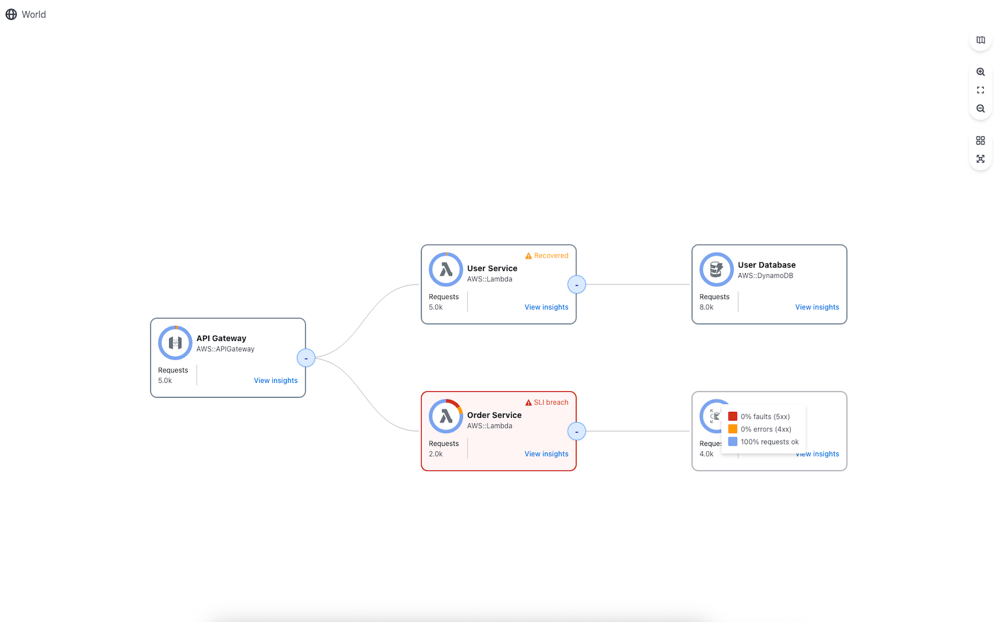

# OpenSearch APM Topology - Service Topology Visualization Library

An open-source React library for visualizing application performance monitoring (APM) service topologies and dependencies.



## Overview

This repository contains the `@ps48/apm-topology` library, a standalone npm package that provides interactive visualization components for APM service maps and topologies. Originally developed as part of the OpenSearch Dashboards APM plugin, it has been extracted into an independent library for broader use.

## Features

- Interactive service map visualization using @xyflow/react
- Automatic graph layout with dagre algorithm
- Customizable service nodes and edges
- Metrics display integration
- Support for hierarchical service groupings
- Comprehensive Storybook documentation
- TypeScript support with full type definitions
- Built with modern React 18

## Installation

```bash
npm install @ps48/apm-topology
```

Or add to your `package.json`:

```json
{
  "dependencies": {
    "@ps48/apm-topology": "^1.0.1"
  }
}
```

**Requirements:**
- React 18.0.0 or higher
- React DOM 18.0.0 or higher

## Quick Start

**Important:** Always use `CelestialMap` component (not `Celestial`), as it provides the required React Flow provider.

```tsx
import React from 'react';
import { CelestialMap, getIcon } from '@ps48/apm-topology';

function App() {
  const mapData = {
    map: {
      root: {
        nodes: [
          {
            id: '1',
            type: 'celestialNode',
            position: { x: 100, y: 100 },
            data: {
              id: '1',
              title: 'API Gateway',
              subtitle: 'AWS::APIGateway',
              icon: getIcon('AWS::APIGateway'),
              isGroup: false,
              keyAttributes: {},
              isInstrumented: true,
              health: {
                breached: 0,
                recovered: 0,
                total: 0,
                status: 'ok',
              },
              metrics: {
                requests: 1500,
                faults5xx: 10,
                errors4xx: 20,
              },
            },
          },
          {
            id: '2',
            type: 'celestialNode',
            position: { x: 400, y: 100 },
            data: {
              id: '2',
              title: 'User Service',
              subtitle: 'AWS::Lambda',
              icon: getIcon('AWS::Lambda'),
              isGroup: false,
              keyAttributes: {},
              isInstrumented: true,
              health: {
                breached: 0,
                recovered: 0,
                total: 0,
                status: 'ok',
              },
              metrics: {
                requests: 1200,
                faults5xx: 5,
                errors4xx: 15,
              },
            },
          },
        ],
        edges: [
          {
            id: 'edge-1',
            source: '1',
            target: '2',
          },
        ],
      },
    },
    onDashboardClick: (node) => {
      console.log('View insights clicked:', node);
    },
    onEdgeClick: (edge) => {
      console.log('Edge clicked:', edge);
    },
  };

  return (
    <div style={{ width: '100%', height: '600px' }}>
      <CelestialMap {...mapData} />
    </div>
  );
}
```

## Live Example

A comprehensive working example demonstrating all library features is available in the [`example/`](./example) directory.

**To run the example:**
```bash
cd example
npm install
npm run dev
```

The example demonstrates:
- AWS service icons (Lambda, DynamoDB, S3, SQS, SNS, etc.)
- Health status indicators and donut charts
- Interactive node/edge click handlers
- Service metrics and health visualization
- Hierarchical service groups
- Real-time event logging

See [example/README.md](./example/README.md) for details.

## Common Issues

Encountering problems? Check the [Troubleshooting Guide](./TROUBLESHOOTING.md) for solutions to common issues:

- **Empty screen?** Make sure you're using `CelestialMap` (not `Celestial`) and passing data as `map={{ root: { nodes, edges } }}`
- **Icons not showing?** Use `getIcon('AWS::ServiceType')` instead of `icon: null`
- **"zustand provider" error?** You're using `Celestial` directly - switch to `CelestialMap`
- **"node.data is undefined"?** Verify your node structure includes `type`, `position`, and `data` properties

See [TROUBLESHOOTING.md](./TROUBLESHOOTING.md) for detailed solutions.

## Documentation

For detailed documentation, API reference, and component usage, see the [library documentation](./lib/README.md).

## Development

### Structure

```
apm-topology/
├── lib/              # Library source code and configuration
│   ├── src/          # Source code
│   ├── docs/         # Documentation
│   ├── .storybook/   # Storybook configuration
│   └── package.json  # Library dependencies and scripts
└── README.md         # This file
```

### Building

```bash
cd lib/
npm install
npm run build
```

### Testing

```bash
npm test              # Run tests with coverage
npm run test:watch    # Run tests in watch mode
```

### Storybook

```bash
npm run storybook     # Start Storybook dev server
```

## Technology Stack

- **React 18** - UI framework
- **TypeScript** - Type safety
- **@xyflow/react** - Flow diagram rendering
- **@dagrejs/dagre** - Graph layout algorithm
- **Vite** - Build tool and dev server
- **Vitest** - Testing framework
- **Storybook** - Component documentation and development

## License

Apache-2.0

## Contributing

This is an open-source project. Contributions are welcome!
