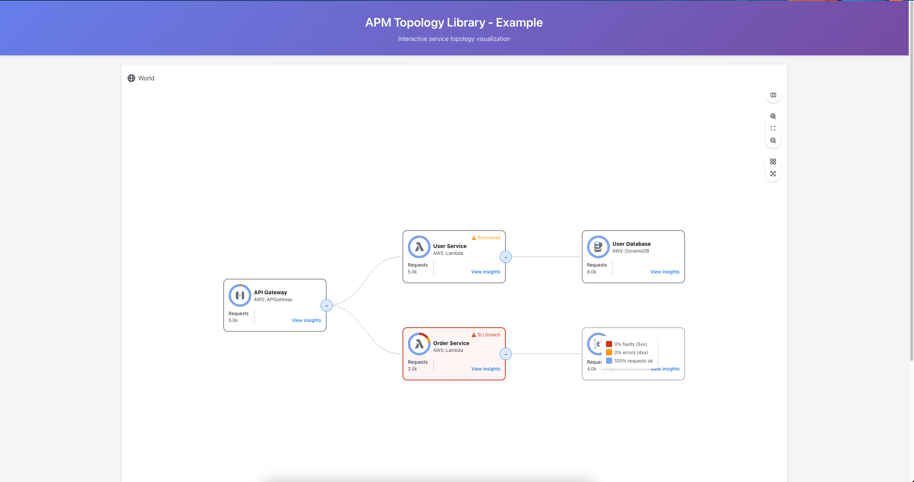

# APM Topology Library - Comprehensive Example

This example demonstrates all major features of the `@opensearch/apm-topology` library in a working React application.



## Features Demonstrated

This example showcases:

### Visual Features
- **AWS Service Icons**: Multiple service types (API Gateway, Lambda, DynamoDB, RDS)
- **Health Status Indicators**: OK (green), Recovered (orange), Breached (red)
- **Donut Charts**: Visual representation of error and fault rates
- **SLI Breach Indicators**: Services breaching SLI thresholds

### Interactive Features
- **"View insights" Click Handler**: Click to view detailed node information
- **Node Details Panel**: Shows service type, health status, and metrics
- **Edge Click Handlers**: Click connections to see relationship details
- **Real-time Event Log**: Track all user interactions
- **Metrics with Percentages**: Automatic calculation of error and fault rates

### Data Features
- **Service Metrics**: Latency, error rates, fault rates, request counts
- **Health Metrics**: Status levels, error/fault percentages
- **Connection Metrics**: Request volume, error rates between services
- **Hierarchical Groups**: Collapsed/expanded group nodes (Analytics Services group)

### Service Architecture
The example implements a realistic microservices architecture:
- API Gateway as entry point
- Lambda functions for business logic
- DynamoDB and RDS databases
- SQS message queue for async processing
- SNS for notifications
- S3 for storage
- CloudFront CDN
- ECS container services

## Getting Started

### Prerequisites
- Node.js 18 or higher
- npm or yarn

### Installation

1. **Build the library** (if not already built):
   ```bash
   cd ../lib
   npm install
   npm run build
   cd ../example
   ```

2. **Install example dependencies**:
   ```bash
   npm install
   ```

### Running the Example

Start the development server:
```bash
npm run dev
```

The application will open in your browser at `http://localhost:3000`.

### Building for Production

```bash
npm run build
```

The production build will be in the `dist/` directory.

### Preview Production Build

```bash
npm run preview
```

## Project Structure

```
example/
├── src/
│   ├── App.tsx          # Main application component
│   ├── App.css          # Styles
│   └── main.tsx         # Entry point
├── index.html           # HTML template
├── package.json         # Dependencies
├── vite.config.ts       # Vite configuration
├── tsconfig.json        # TypeScript config
└── README.md            # This file
```

## Understanding the Code

### App.tsx

The main application file demonstrates:

1. **Data Structure Setup**:
   - Defines comprehensive `nodes` array with service metadata
   - Defines `edges` array with connection information
   - Each node includes metrics, health status, and type information

2. **Event Handlers**:
   ```tsx
   const handleNodeClick = (node) => {
     // Handle node selection
   };

   const handleEdgeClick = (edge) => {
     // Handle edge selection
   };

   const handleNodeDoubleClick = (node) => {
     // Handle double-click events
   };

   const handleNodeContextMenu = (node, event) => {
     // Handle right-click events
   };
   ```

3. **Celestial Component Usage**:
   ```tsx
   <Celestial
     nodes={topologyData.nodes}
     edges={topologyData.edges}
     onNodeClick={handleNodeClick}
     onEdgeClick={handleEdgeClick}
     onNodeDoubleClick={handleNodeDoubleClick}
     onNodeContextMenu={handleNodeContextMenu}
   />
   ```

## Customization

### Adding New Service Types

To add a new service type, add a node with the appropriate AWS type:

```tsx
{
  id: 'my-service',
  name: 'My Service',
  type: 'AWS::ServiceName',  // e.g., 'AWS::EKS', 'AWS::Kinesis'
  metrics: {
    latency: 100,
    errorRate: 0.01,
    requestCount: 1000
  },
  health: {
    status: 'healthy',
    errorPercentage: 1,
    faultPercentage: 0
  }
}
```

### Modifying Health Status

Health status can be:
- `'healthy'`: Green indicator
- `'warning'`: Yellow indicator
- `'critical'`: Red indicator

### Adding SLI Breach Status

Add `sliStatus: 'breached'` to the health object:

```tsx
health: {
  status: 'critical',
  errorPercentage: 15,
  faultPercentage: 8,
  sliStatus: 'breached'  // Shows breach indicator
}
```

### Creating Group Nodes

Group nodes allow you to represent collections of services:

```tsx
{
  id: 'my-group',
  name: 'My Service Group',
  type: 'group',
  isGroup: true,
  collapsed: true,      // Whether group is collapsed
  childCount: 5,        // Number of services in group
  metrics: { /* aggregate metrics */ },
  health: { /* aggregate health */ }
}
```

## Common Use Cases

### 1. Real-time Monitoring Dashboard
Use the library to display live service health and connections, updating the data periodically.

### 2. Incident Investigation
Click on services showing high error rates to drill down into details and trace connections.

### 3. Architecture Visualization
Use group nodes to organize services by team, environment, or function.

### 4. Capacity Planning
Display throughput and load metrics to identify bottlenecks.

## Troubleshooting

### Library not found
Make sure the library is built:
```bash
cd ../lib && npm run build
```

### Types not working
Ensure TypeScript can find the library types:
```bash
cd ../lib && npm run types:check
```

### Styles not loading
The library injects its CSS automatically. Make sure you're importing from the correct package.
